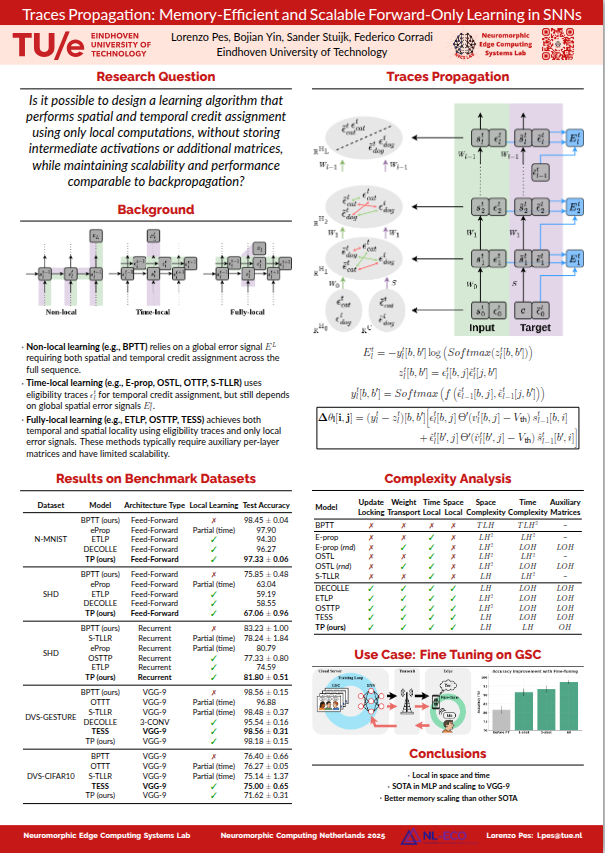

# Traces Propagation: Memory-Efficient and Scalable Forward-Only Learning in Spiking Neural Networks

This repository can be used to reproduce the experiments reported in the paper:

- experiments/cifar10dvs.sh
- experiments/dvsgesture.sh
- experiments/nmnist.sh
- experiments/shd
- experiments/fine_tune_gsc.sh 

The implementation of TP for MLP can be found in models/tp_mlp.py while the impelementation for CNN is found models/tp_cnn.py. 

  

